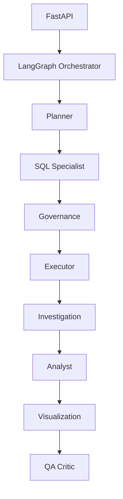

# InsightBridge


**Conversational BI agent** — ask business questions in natural language, get validated read-only SQL, insights, charts, and an audit trail. Runs locally against Docker Postgres with **demo mode** (no OpenAI key required).

| | |
|---|---|
| **GitHub** | https://github.com/JkayAy/data_analytics_and_BI_agent |
| **Agent roster** | `GET /v1/agent/capabilities` |
| **Claim audit** | [docs/CLAIM_AUDIT.md](docs/CLAIM_AUDIT.md) |

## What works today (verified)

- **Demo mode (no API key):** All six example questions below return SQL, pass governance, execute against Postgres, produce insight + chart, and log an audit row. Covered by `tests/test_demo_flow.py` (33 tests total).
- **8-agent pipeline:** Planner → SQL Specialist → Governance → Executor → Investigation → Analyst → Visualization → QA Critic — implemented in `apps/api/insightbridge/multi_agent/nodes.py`, orchestrated via LangGraph (sequential fallback if LangGraph unavailable). Every demo ask produces a trace entry for all eight agents.
- **Investigation mode (demo):** *Why is MRR uneven across regions?* runs extra follow-up queries and ranked drivers.
- **Governance:** sqlglot validation, schema allowlist, row limit, timeout, PII column masking (deterministic, not LLM-based).
- **Web UI:** Chat, agent trace, audit log, feedback.
- **LLM mode:** Supported when `OPENAI_API_KEY` is set — **not verified in CI**; Planner/QA use OpenAI, SQL uses `generate_sql()` with LLM fallback.

## Optional enterprise modules (code present; run migrations)

These are implemented in the API but require `scripts/migrate-docker.ps1` (includes `07_e5_tenancy.sql`, `08_e6_delivery.sql`) and optional env config:

| Module | Docs |
|--------|------|
| E5 — magic-link JWT, org RBAC, encrypted connections, audit CSV | [E5_TENANCY.md](docs/E5_TENANCY.md) |
| E6 — Slack/Teams webhooks, scheduled reports, usage caps | [E6_DELIVERY.md](docs/E6_DELIVERY.md) |

Default local setup uses `AUTH_REQUIRED=false` (demo org) so chat works without login.

## Quick start (local)

**Prerequisites:** Docker Desktop, Python 3.11+, Node 20+

```bash
docker compose up -d
```

Apply migrations (fresh clone or after pull):

```powershell
# Windows
.\scripts\migrate-docker.ps1
```

**API**

```bash
cd apps/api
python -m venv .venv
# Windows: .venv\Scripts\activate
pip install -r requirements.txt
copy ..\..\.env.example ..\..\.env   # or cp on macOS/Linux
uvicorn insightbridge.main:app --reload --port 8000
```

**Web**

```bash
cd apps/web
npm install
# Windows PowerShell:
$env:NEXT_PUBLIC_API_URL="http://localhost:8000"
npm run dev
```

Open http://localhost:3000 · Audit: http://localhost:3000/audit

**Verify demo mode:** `cd apps/api && pytest tests/test_demo_flow.py -v`

## Example questions (demo mode, no API key)

- What is our total MRR?
- Show MRR by region
- What is our churn rate?
- Top 10 customers by MRR
- Order revenue by month
- **Why is MRR uneven across regions?** (investigation mode)

## Architecture



Details: [ARCHITECTURE.md](docs/ARCHITECTURE.md) · [AGENTS.md](docs/AGENTS.md)

## Tech stack

Next.js 15 · FastAPI · LangGraph · PostgreSQL · sqlglot · OpenAI (optional) · Recharts

## API

| Method | Path | Description |
|--------|------|-------------|
| GET | `/health` | Status, `demo_mode`, version |
| GET | `/v1/agent/capabilities` | Agent roster |
| GET | `/v1/audit/query-runs` | Audit log |
| POST | `/v1/conversations` | New thread |
| POST | `/v1/conversations/{id}/ask` | Ask + audit |
| POST | `/v1/query-runs/{id}/feedback` | Up/down vote |

## Tests & CI

```bash
cd apps/api && pytest -q && ruff check insightbridge tests
cd apps/web && npm run lint && npm run build
```

## Roadmap (not verified end-to-end)

- Public Vercel/Railway deploy (configs exist in `docs/DEPLOY.md`)
- Stripe billing · OIDC SSO · analyst metric approval workflow

See [ENTERPRISE_ROADMAP.md](docs/ENTERPRISE_ROADMAP.md).

## License

MIT
