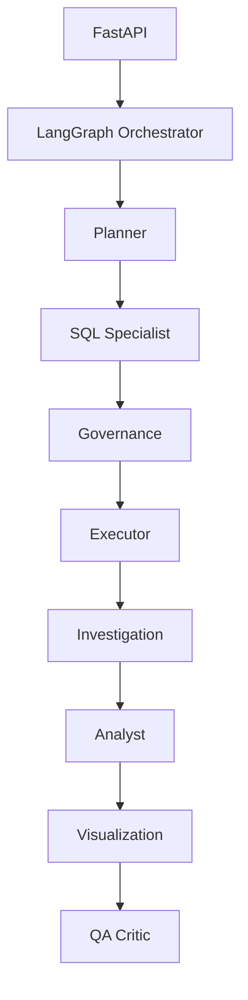

# InsightBridge


**Enterprise multi-agent BI platform** — eight specialist agents (Planner, SQL, Governance, Executor, Investigation, Analyst, Visualization, QA) orchestrated with **LangGraph**, running locally against Postgres with full **agent trace** in the UI.

Built to show how agent teams remove analyst bottlenecks for metrics, breakdowns, and investigations (portfolio + local pilot ready).

| | |
|---|---|
| **Live demo** | _Add after Vercel deploy:_ `https://your-app.vercel.app` |
| **GitHub** | `https://github.com/JkayAy/data_analytics_and_BI_agent` |
| **Agent roster** | `GET /v1/agent/capabilities` |
| **Roadmap** | [docs/ENTERPRISE_ROADMAP.md](docs/ENTERPRISE_ROADMAP.md) |

## Features (v0.3 — multi-agent)

- **8-agent pipeline** with LangGraph (+ sequential fallback)
- **Investigation mode** — multi-query driver analysis (try: *Why is MRR uneven across regions?*)
- Chat UI with **agent trace**, plan, and investigation SQL
- Demo mode (no OpenAI) + LLM mode for open-ended asks
- Governance: sqlglot, schema allowlist, LIMIT, timeout, PII mask
- Audit log + feedback
- Docker Postgres seed, CI, Vercel/Railway configs

## Problem → solution

| Business pain | InsightBridge |
|---------------|---------------|
| Days waiting for SQL + dashboards | Minutes via conversational ask |
| Distrust of “AI SQL” | Every answer shows generated SQL + audit row |
| Data risk | SELECT-only, schema allowlist, LIMIT, timeout, PII column masking |

## Architecture



Details: [docs/ARCHITECTURE.md](docs/ARCHITECTURE.md) · [docs/MULTI_AGENT_BLUEPRINT.md](docs/MULTI_AGENT_BLUEPRINT.md)

## Tech stack

Next.js 15 · FastAPI · **LangGraph** · PostgreSQL · sqlglot · OpenAI (optional) · Recharts

## Quick start (local)

**Prerequisites:** Docker Desktop, Python 3.11+, Node 20+

```bash
docker compose up -d
```

**API**

```bash
cd apps/api
python -m venv .venv
# Windows: .venv\Scripts\activate
pip install -r requirements.txt
cp ../../.env.example ../../.env   # Windows: copy
uvicorn insightbridge.main:app --reload --port 8000
```

**Web**

```bash
cd apps/web
npm install
# Windows PowerShell:
$env:NEXT_PUBLIC_API_URL="http://localhost:8000"
npm run dev
```

Open [http://localhost:3000](http://localhost:3000) · Audit: [http://localhost:3000/audit](http://localhost:3000/audit)

**Existing DB?** Run `infra/seed/03_migrate.sql` after pulling latest.

## Example questions (demo mode, no API key)

- What is our total MRR?
- Show MRR by region
- What is our churn rate?
- Top 10 customers by MRR
- Order revenue by month
- **Why is MRR uneven across regions?** (investigation mode — multi-agent)

## API

| Method | Path | Description |
|--------|------|-------------|
| GET | `/health` | Status, demo_mode, multi_agent |
| GET | `/v1/agent/capabilities` | Agent roster + graph version |
| GET | `/v1/audit/query-runs` | Audit log |
| POST | `/v1/conversations` | New thread |
| POST | `/v1/conversations/{id}/ask` | Ask + audit |
| POST | `/v1/query-runs/{id}/feedback` | Up/down vote |
| POST | `/v1/ask` | Stateless ask |

## Deploy later (Vercel + Railway)

1. Push to GitHub — [docs/PUSH_TO_GITHUB.md](docs/PUSH_TO_GITHUB.md)
2. Railway: Postgres + run `infra/seed/01_schema.sql`, `02_data.sql`
3. Railway: deploy API (`apps/api/Dockerfile`, root context) — see [docs/DEPLOY.md](docs/DEPLOY.md)
4. Vercel: root directory **`apps/web`**, set `NEXT_PUBLIC_API_URL`, optional env vars

## Project structure

```
apps/api/          FastAPI agent + validator
apps/web/          Next.js UI (chat, audit, about)
packages/semantic-layer/metrics.yaml
infra/seed/        Postgres schema + demo data
docs/              ENTERPRISE_ROADMAP, MULTI_AGENT_BLUEPRINT, AGENTS, DEPLOY
apps/api/insightbridge/multi_agent/   LangGraph orchestration
```

## Phase E5 — Tenancy & compliance

- Magic-link JWT auth, org RBAC, org-scoped data
- Encrypted warehouse connection configs
- Audit CSV export

See [docs/E5_TENANCY.md](docs/E5_TENANCY.md).

## Phase E6 — Delivery & ops

- Slack/Teams webhooks, scheduled reports, usage caps

See [docs/E6_DELIVERY.md](docs/E6_DELIVERY.md).

## Roadmap (beyond E6)

Slack/Teams · scheduled agents · Stripe · SSO · analyst metric approval workflow

## License

MIT

## Resume bullet

Built InsightBridge, a conversational BI agent: natural language → validated read-only SQL on Postgres, automated insights and charts, semantic metrics layer, audit log, and feedback — deployable on Vercel + Railway.
