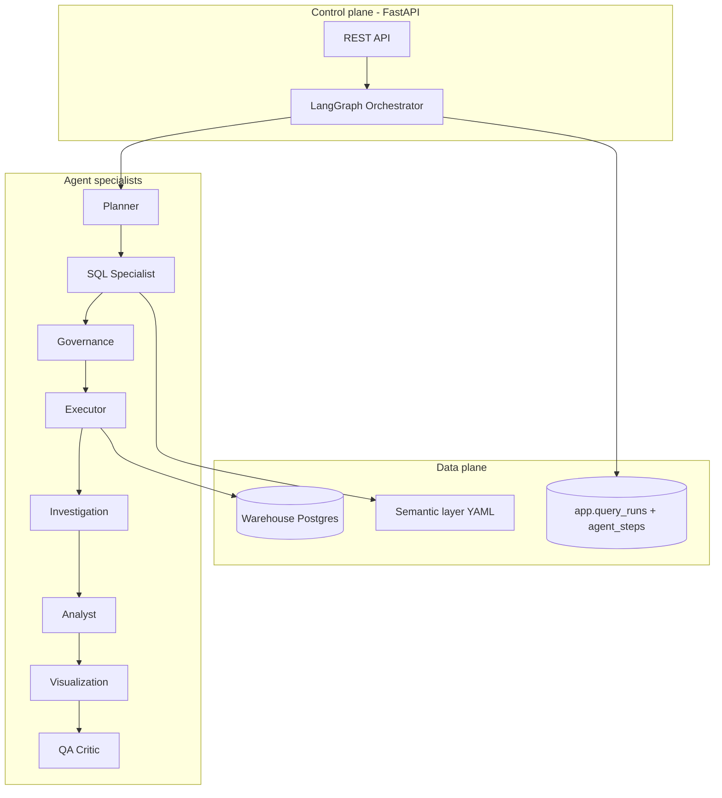

# Multi-Agent Blueprint

## Control plane vs data plane

## Shared state (`BIAgentState`)

| Field | Purpose |
|-------|---------|
| `question` | User natural language ask |
| `history` | Prior turns (E2) |
| `intent` | `metric` / `breakdown` / `trend` / `investigation` |
| `mode` | `standard` or `investigation` |
| `plan_steps` | Human-readable plan from Planner |
| `sql` | Current primary SQL |
| `investigation_runs` | List of `{purpose, sql, rows, columns}` |
| `assumptions`, `metrics_used`, `sql_source` | Lineage |
| `columns`, `rows`, `duration_ms` | Primary result |
| `chart_spec`, `insight` | Deliverables |
| `qa_passed`, `qa_notes` | QA Critic |
| `agent_trace` | Ordered `{agent, action, detail, ms}` for UI |
| `status`, `error` | Terminal state |

## Graph edges (E1)

1. **START → planner**
2. **planner → sql_specialist**
3. **sql_specialist → governance** (validate only)
4. **governance →** on fail → **sql_specialist** (if attempts &lt; 3) else **END fail**
5. **governance → executor** on pass
6. **executor → investigation** if `mode=investigation` else **analyst**
7. **investigation → analyst** (append secondary queries in trace)
8. **analyst → visualization → qa_critic**
9. **qa_critic → END** or one retry **sql_specialist** if QA fails

## Demo mode (no `OPENAI_API_KEY`)

- Planner: keyword rules (`why`, `root`, `driver` → investigation)
- SQL: `demo_sql.py` patterns
- Investigation: auto second query (e.g. MRR by region after MRR total)
- Analyst / QA: deterministic heuristics

## LLM mode

- Planner, SQL, Analyst, QA use structured JSON via OpenAI
- Same graph; richer plans and multi-step investigation SQL

## API contract additions

- Response field: `agent_trace: list[AgentTraceStep]`
- `GET /v1/agent/capabilities` — agent roster + graph version
- Optional persistence: `app.agent_steps` per query run (E1)

## Security (unchanged principles)

- Read-only SELECT only
- Schema allowlist from semantic layer
- Row limit + statement timeout
- PII column masking post-query
